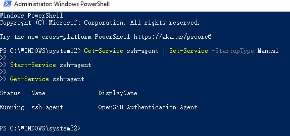
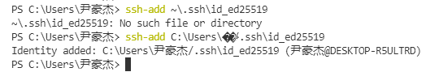

1. run powershell as administer
2. enter 
```
ssh-keygen -t ed25519
```
3. press enter for any question asking
4. enter the following code
```
Get-Service ssh-agent | Set-Service -StartupType Manual

Start-Service ssh-agent

Get-Service ssh-agent
```
the page should look like that:

5. enter `ssh-add C:\Users\尹豪杰/.ssh\id_ed25519`


6. we are good to go