# Remote Access
[Lab Report 1](lab-report-1-week-2.html)
note: I use my own account name for this tutorial, if you need to use the code remember to replace your own account name.
* **step1-download vscode**

    In this step, we need to download and install vscode IDE in your computer. Here is the official web of vscode download: [Link](https://code.visualstudio.com/)
    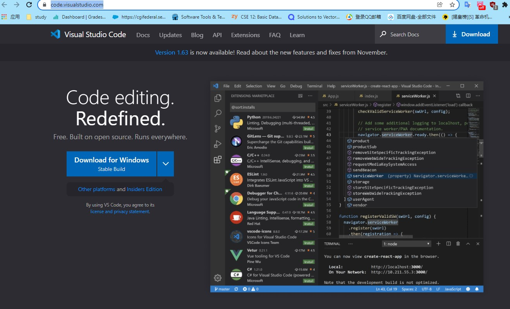
---
* **step2-Remotely Connecting**
1. Because I am using windows system, I need to install the [openSSH](openssh.html).
2. open the vscode now, open a new terminal.
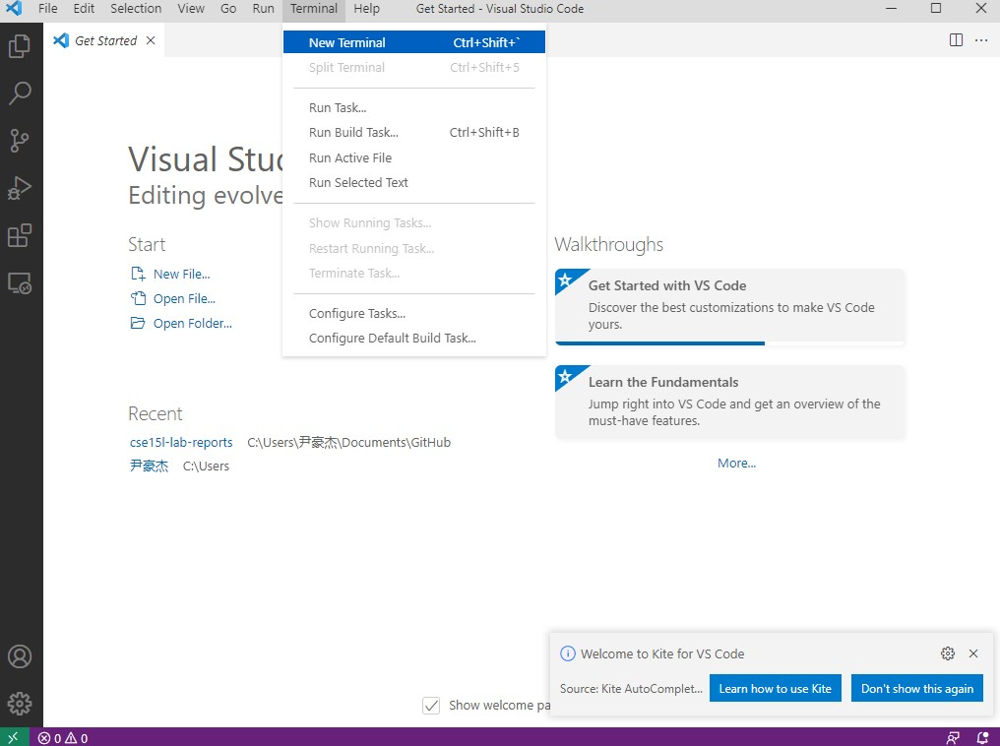
3. in the terminal, enter 
```
ssh cs15lwi22awj@ieng6.ucsd.edu
```
4. enter the password
5. then I can access the server:
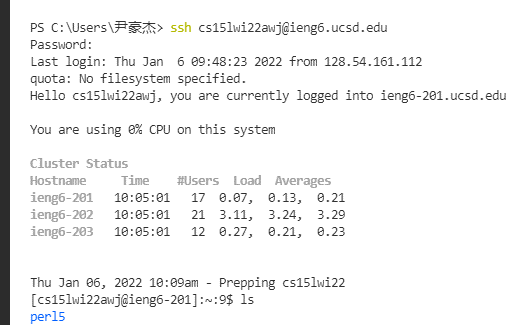
---
* **step3-Run Some Commands**
```
cd
cd ~
ls -lat
ls -a
ls /home/linux/ieng6/cs15lwi22/cs15lwi22awj
...
```
Here is what I tried:
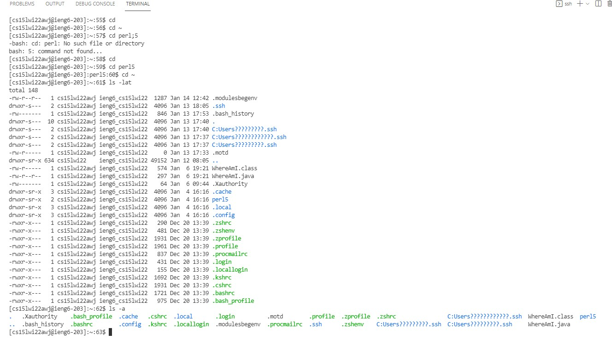)

> cd ___: go to ___ directory, if no giving directory, default go to home directory

> cd ~: go back to last upper directory

> ls -lat: list the file and directory in current directory by column, with details of files

> ls -a: simply list all the file and directory in current directory

---

* **step4-Moving Files over SSH with scp**
1. create a **.java** file in my desktop folder with the following:
```
class WhereAmI {
  public static void main(String[] args) {
    System.out.println(System.getProperty("os.name"));
    System.out.println(System.getProperty("user.name"));
    System.out.println(System.getProperty("user.home"));
    System.out.println(System.getProperty("user.dir"));
  }
}
```
2. I tried run this file in my own computer firstly

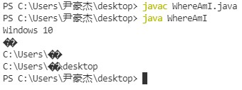

>that shows my computer system is windows10, my user name, my home directory, and my current directory.


3. open a new powershell by click the **+** in the upper-right cornor:
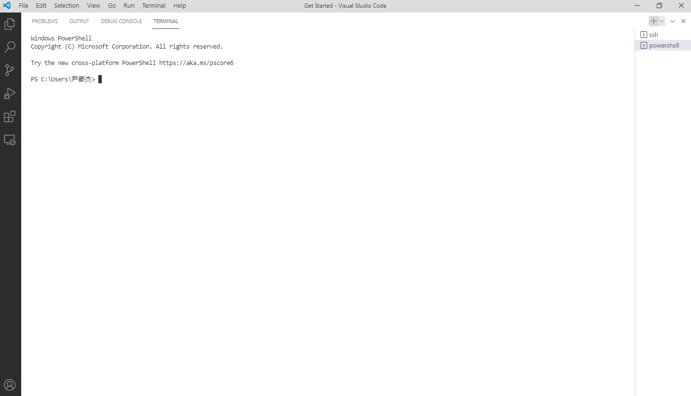
4. first go to desktop folder by `cd desktop`
5. enter 
```
scp WhereAmI.java cs15lwi22awj@ieng6.ucsd.edu:~/
```
and enter the password

6. we see this picture, then it is successfully uploaded
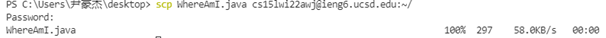

7. then I go back to the terminal of ssh, use `ls` to check if the uploaded one is there, the use javac and java to run this file.
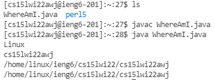
> that shows I am currently use linux system in the ssh server, with my account name, my home directory and my current directory

---

* **step5-SSH Keys**
1. because I am using windows system, I need to do extra [steps](SSH_Keys_wins.html).
2. then I create a folder in ssh terminal by entering
```
mkdir .ssh
```

3. then I upload this key file to ssh server by enter in the windows powershell:
```
cd .ssh
scp id_ed25519.pub cs15lwi22awj@ieng6.ucsd.edu:~/.ssh/authorized_keys
```

4. we should see this now:
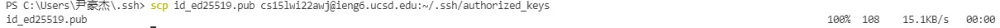
5. close the ssh terminal, open a new terminal, try to login server again:
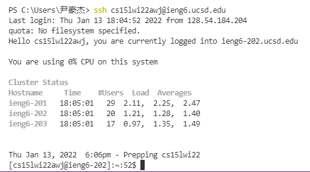
> now I don't need to enter the password again.
---
* **step6-Making Remote Running Even More Pleasant**
1. in windows terminal, I tried:
```
ssh cs15lwi22@ieng6.ucsd.edu "ls"
```
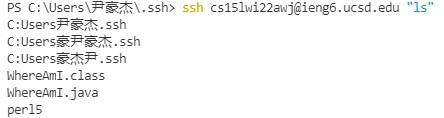
> I can easily see what files or directoies in my ssh server
2. I can use **;** to do mutiple command in ssh terminal:
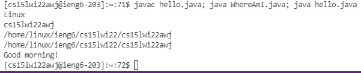
> I can run both java file as well
---

End of Lab Report 1
Thanks for watching.
