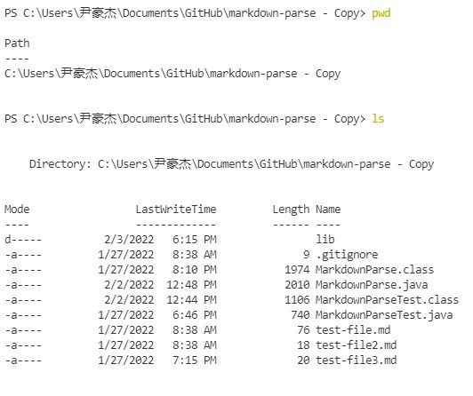
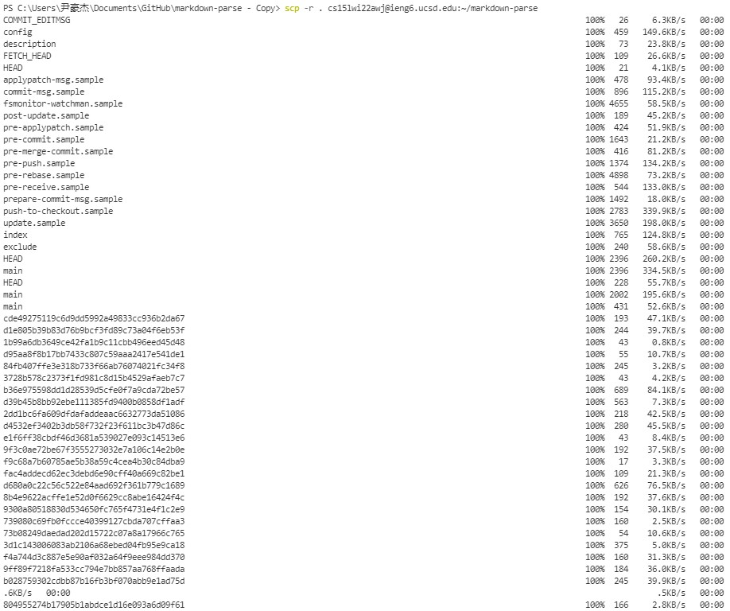
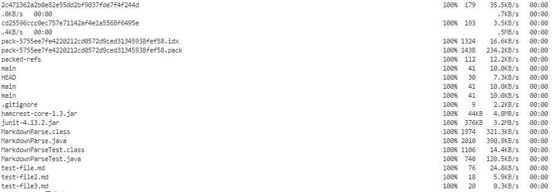
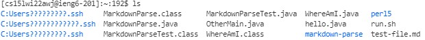
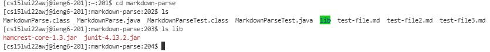
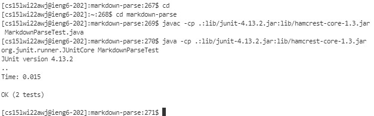
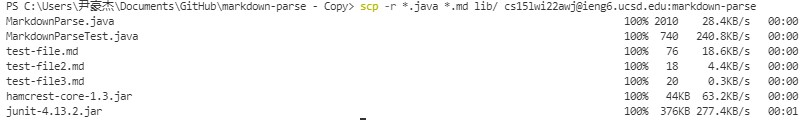
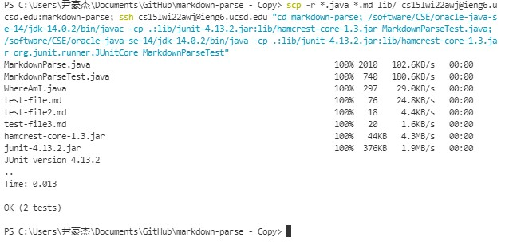

## lab report 3-copy whole directory with scp -r

---

* ## check if we are in the correct directory for uploading

    We firstly use `pwd` to check current path and 'ls' to check what is inside current directory:  

    
    

---

* ## using `scp -r` to copy
    ```
    scp -r . cs15lwi22awj@ieng6.ucsd.edu:~/markdown-parse
    ```
    
    

    >we can see everything in current directory is uploaded, including tons of things uploaded into ssh beside the files we need for markdownparse. Without these unnecessary files, the markdownparse can still run.

     - Analysis: `scp -r` is to copy everything in current directory, including the directory in current directory (`lib`).
    
---

* ## check if we successfullly copied to ssh server and try to run it
    After we login ssh server, by using `ls `, we can see there is a `markdown-parse` directory:
    

    And then we can see everything is successfully uploaded:
    

    Then we try to run it:

    

    >Everything is working good!

* ## try only copying the files we need 

    By using the following:
    
    ```
    scp -r *.java *.md lib/ cs15lwi22awj@ieng6.ucsd.edu:markdown-parse
    ```

    

    > we can see in this time, we only copy all the `.java` files, `.md` files, and the two files in `lib` directory.

    - Analysis: The `scp -r` can combine with restrictions like `*.java *.md lib/` to only copy the files in the restriction. `*.java` means every `java` file. `*.md` means every `md` file. `lib/` means the `lib` directory. With these restriction, we can only upload the file we need, saving some time.

* ## put multiple commands in one line
    We can do copying the whole directory, and compile and run the file in ssh server at the same time, by using 

    ```
    scp -r *.java *.md lib/ cs15lwi22awj@ieng6.ucsd.edu:markdown-parse; ssh cs15lwi22awj@ieng6.ucsd.edu "cd markdown-parse; /software/CSE/oracle-java-se-14/jdk-14.0.2/bin/javac -cp .:lib/junit-4.13.2.jar:lib/hamcrest-core-1.3.jar MarkdownParseTest.java; /software/CSE/oracle-java-se-14/jdk-14.0.2/bin/java -cp .:lib/junit-4.13.2.jar:lib/hamcrest-core-1.3.jar org.junit.runner.JUnitCore MarkdownParseTest"
    ```

    > The first part is doing the copying, after `;`, we login in to ssh server and doing all the command in `""`. Of course all the commands are seperated by `;` as well. 

    So the result is like:

    
    >That works!

---

End of 3rd lab report. Thanks for watching:)


