## lab report 4

- [my markdownparse](https://github.com/heihaheihahello/markdown-parse)
- [reviewed markdownparse](https://github.com/zhl010/markdown-parse/tree/24a93ada0f11daeb57ca6184866e2c5c0386c29c)

---

* [Snippet1](Snippet1.md)

    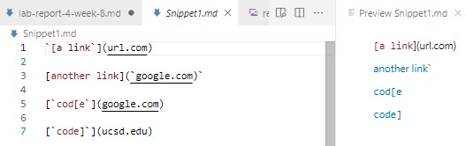
    >we can see the following links which should be collected by `markdownparse`:

    ```
    `google.com
    google.com
    ucsd.edu
    ```

    These are tests for `Snippet1`:
    
    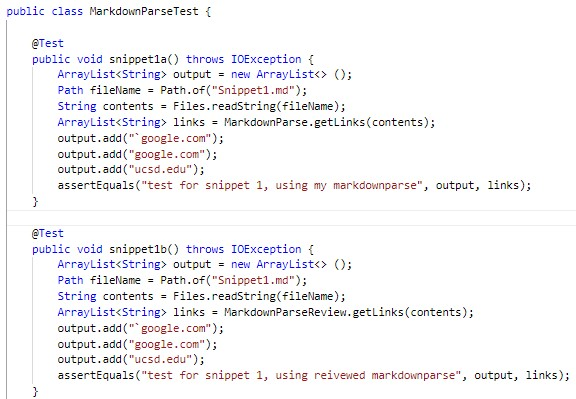

    - result of my `MarkdownParse`test: not pass
    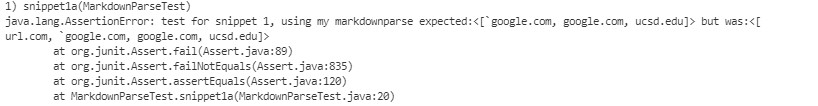
    > My `MarkdownParse` count `url.com` as link too but it isn't.

    - result of reviewed `MarkdownParse`test: not pass
    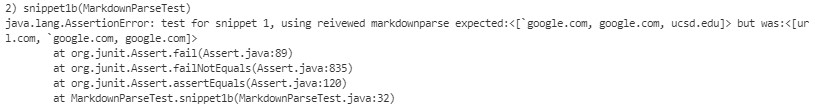
    > Reviewed `MarkdownParse` count `url.com` as link too but it isn't, and it did not count `ucsd.edu` which is a link.

    * Do you think there is a small (<10 lines) code change that will make your program work for snippet 1 and all related cases that use inline code with backticks? If yes, describe the code change. If not, describe why it would be a more involved change.

    **Answer:** I don't think a small code change will solve this. Like the first item with one backtick before the `[`, we need to check if the file has even or odd number of backticks before the `[`. We know even number of backticks will not cause any effect to the link format, however, the odd number of backticks will turn part of link format into `code` (just like this) if there is odd number of backticks. In other words, we need to char by char check all the text before `[` and inside the `[]` to make sure the number of backticks is even or odd before count a link. This process cannot be finished by a small change of code. We need a extra check method for this and implement this method in the while loop of markdown.

---

* [Snippet2](Snippet2.md)
    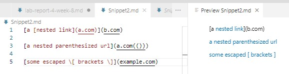
    >we can see the following links which should be collected by `markdownparse`:

    ```
    a.com
    a.com(())
    example.com
    ```

    These are tests for `Snippet2`:
    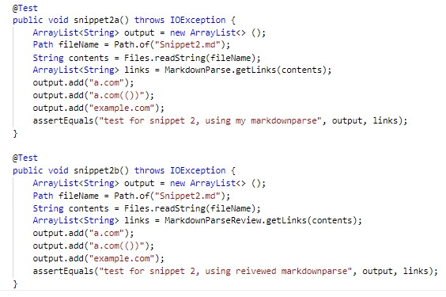

    - result of my `MarkdownParse`test: not pass
    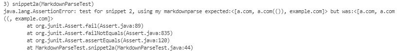
    > For `a.com(())`, My `MarkdownParse` only collect `a.com((`.

    - result of reviewed `MarkdownParse`test: not pass
    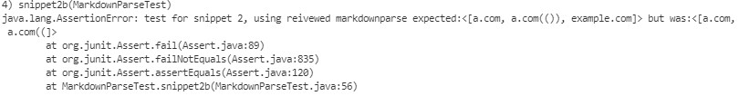
    > Reviewed `MarkdownParse` did not count the `))` as part of link as well, and it does not collect `example.com`.

    * Do you think there is a small (<10 lines) code change that will make your program work for snippet 2 and all related cases that nest parentheses, brackets, and escaped brackets? If yes, describe the code change. If not, describe why it would be a more involved change.

    **Answer:** I don't think a small change of code can solve that. To solve this problem, we need to count the numbers of `(` and the number of `)` after we find the `[]` pair. Only when the numbers of `(` become the same as `)`, the `()` cancelled each other, then we can collect everything inside the most outside `()` as link. In addition, we are not sure what exists between `()`. If there is a link inside, for example, `([a link](wcwcwcw)wcwcw)`, that will cause further effect of our searching of `[]`. To search and equal the number of `(` and `)` need more than 10 lines. 
    
---

* [Snippet3](Snippet3.md)
    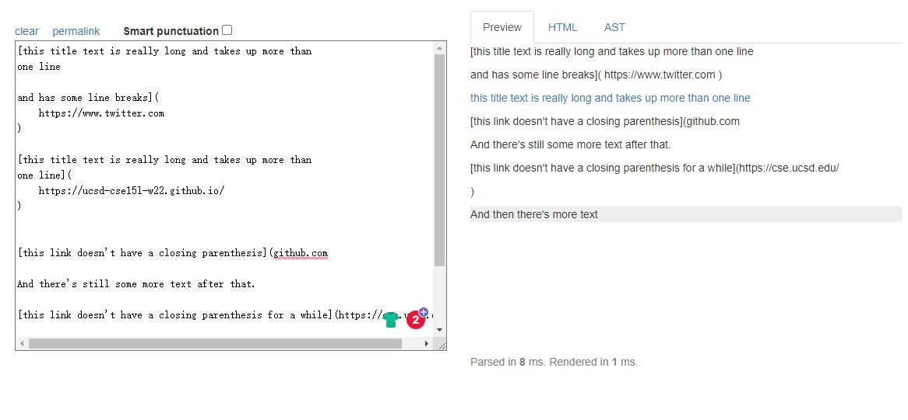
    >we can see the following links which should be collected by `markdownparse`:

    ```
    https://ucsd-cse15l-w22.github.io/
    ```

    These are tests for `Snippet3`:
    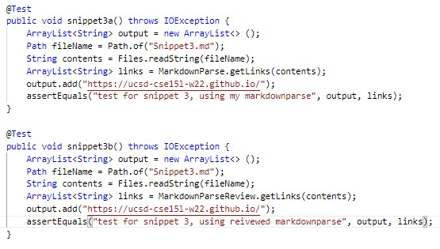

    - result of my `MarkdownParse`test: not pass
    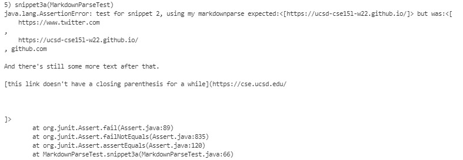
    >My `MarkdownParse` did not consider the `\n` at all.

    - result of reviewed `MarkdownParse`test: not pass
    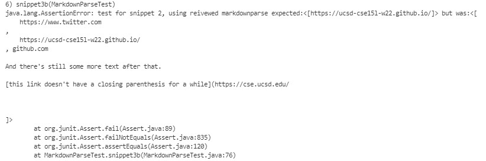
    > Reviewed `MarkdownParse` did not consider the `\n` at all.

    * Do you think there is a small (<10 lines) code change that will make your program work for snippet 3 and all related cases that have newlines in brackets and parentheses? If yes, describe the code change. If not, describe why it would be a more involved change.

    **Answer:** I tried to solve this but with more than 10 lines of codes. You can also check the new [markdownparse](https://github.com/heihaheihahello/markdown-parse/commit/4ec61f5725e3e45fb3159fdea81b750129c734cd). I will say a small change is not enough. In my way to solve it, I create a method to check the empty lines between `[]` and `{}`. 
    ```
    public static boolean checkempty(int startindex, int endindex, String contents) {
        for (int i = startindex; i<endindex; i++) {
            if (contents.substring(i, i+1).contains("\n")) {
                if (contents.substring(i+2, i+3).contains("\n")) {
                    return true;
                }
            }
        }
        return false;
    }
    ```
    By this method, I can check if there is one empty line. If so, I will make the while loop of markdownparse to jump after current `[]{}` and continue to look for the next. So I add the following in the while loop:
    ```
    //after get index of `[]`
    if (checkempty(nextOpenBracket,nextCloseBracket,markdown)) {
                currentIndex++;
                continue;
            }

    //after get index of `()`
    if (checkempty(openParen,closeParen,markdown)) {
                currentIndex = closeParen + 1;
                continue;
            }
    ```
    There is totally 18 lines used to solve the empty lines with link format. And it pass the [test](https://github.com/heihaheihahello/markdown-parse/blob/main/test.java): 
    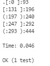
    >I believe that this solution can be improved to less code, but a small change of code is still hard to achieve for this problem.

    ---
    end of 4th lab report.
    Thanks for watching:)

    

