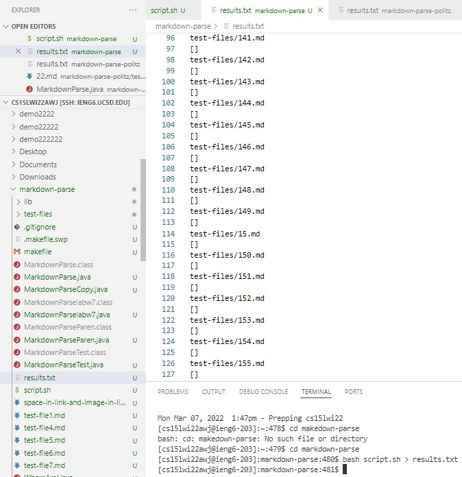
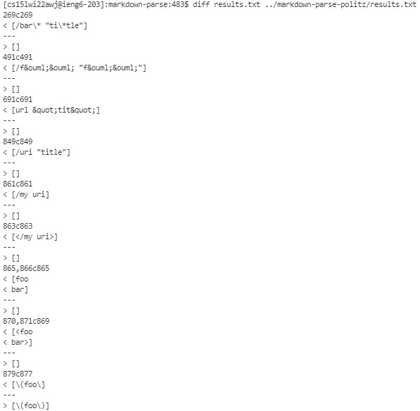
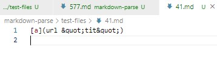
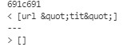
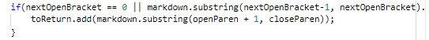
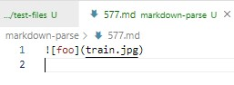
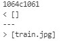
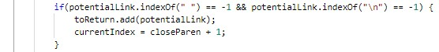

## lab report 5

---

* ## Looking for bugs using diff
    (1) We need to create a file contains all the result from test cases by using
    
    ```
    bash script.sh > results.txt
    ```
    > this command can run the `script.sh` and store all the result of test cases into a file named `results.txt`.

    
    >In the directory we can see a new file `results.txt` is created. In this file we can see all the test files and corresponding results.

    (2) Repeating the step 1 for my own `markdownParse` and provided `markdownParse`

    (3) Now we can use command `diff` to compare two groups of results by using
    ```
    diff results.txt ../markdown-parse-politz/results.txt
    ```

    Then we can get the following comparison:

    
    (more difference...)
    > for each difference, we can see the line having difference in `results.txt`, and the difference itself. By tracing the line in the `results.txt`, we can see which test file causing difference and look for the bugs.

---
* ## Analyze two test with different results
    * ## **test 1-[41.md](41.md)**
    
    > notice that the github see `41.md` as link but it is not. 
    
    Difference: 

    
    > by looking at line 691 of my `results.txt` we can see this difference is caused by `41.md`, and my output is `[url &quot;tit&quot;]` while the provided `MarkdownParse`'s output is `[]`.

    ### **Analysis**: 
    - **whose is correct**； By using the preview function, this "link" turns in `[a](url "tit")` and is not counted as link. So my `MarkdownParse` is wrong and the provided `MarkdownParse` is correct. 
    - **analyze the bug**: If we look at the preview, it is interesting that `&quot;` turn in `"` in the preview instead of keeping the form of txt `&quot;`. When this `md` file turn into `html` file, all chars of `&quot;` will turn in `"`. And if we delete the ` ` between `url` and `&quot;tit&quot;`, we can notice now this content seems as a link. And if we keep this space ` ` and delete one `;`, this content is not a link. So the conclusion is that the problem causing bug is not such html character entities of &quot;. The real problem causing bug is the space` ` between contents in `()`.
    - **Solution**: So solve this bug, we need to check if there is ` ` between contents in `()`. Notice that we can not directly check if everything inside the `()` contans space ` ` because it is ok to add space before the link or after the link. We only need to check if there is space ` ` within the link. We can use the `.trim()` to clean the space` ` before and after the link. The `.trim()` will not affect the space` ` within the link. That is what we want. And then we can add a if statement to check if this cleaned potential link has space ` `. If so, this potential link is not a link and we will not add it into result.
    >To fix it in my `MarkdownParse`, we can do revise here: &darr;

     
    > before this `if` statement, we can use the `.trim()` to clean the potential link, and then in the checking condition of this `if` statement, we can add one more condition to check if this potential link contains ` `. If there exist space ` `, then we will not `add` this potential link. 

    ---
    * ## **test 2-[577.md](577.md)**
    
    
    Difference: 

    
    > by looking at line 1064 of my `results.txt`, we can see this difference is caused by `577.md`, and my output is `[]` while the provided `MarkdownParse`'s output is `[train.jpg]`.

    ### **Analysis**: 
    - **whose is correct**； By using the preview function, this "link" is actually a image and is not counted as link. So my `MarkdownParse` is correct and the provided `MarkdownParse` is incorrect. 
    - **analyze the bug**: becuase the code to add image ``is almost the same as the code of link`[...](...)`. The only difference is the `!` before `[]`. And the provided `MarkdownParse` does not check if there is a `!` before `[]` so that it will treat all images as links, and causing bugs. My 'MarkdownParse' has this check so it works good. 
    - **Solution**: To solve it, we need to check if there is a `!` before the `[...](...)` form we found. So at the `if` statement of adding the link into result, we can add the one extra checking statement to check the String before `[` is `!` or not. If so, we skip this potential link and look for next. If not, that means this potential link is a link and we can add it into the result.
    >In the provided `MarkdownParse`, we can find the the following `if` statement as the last checking point and add the fixing statement here:&darr;

     
    
    For example, one workable checking statement is the following(the one my `MarkdownParse` used):
    ```
    markdown.substring(nextOpenBracket-1, nextOpenBracket).equals("!") == false
    ```

---
End of 5th lab report.
Thanks for watching:)

    

