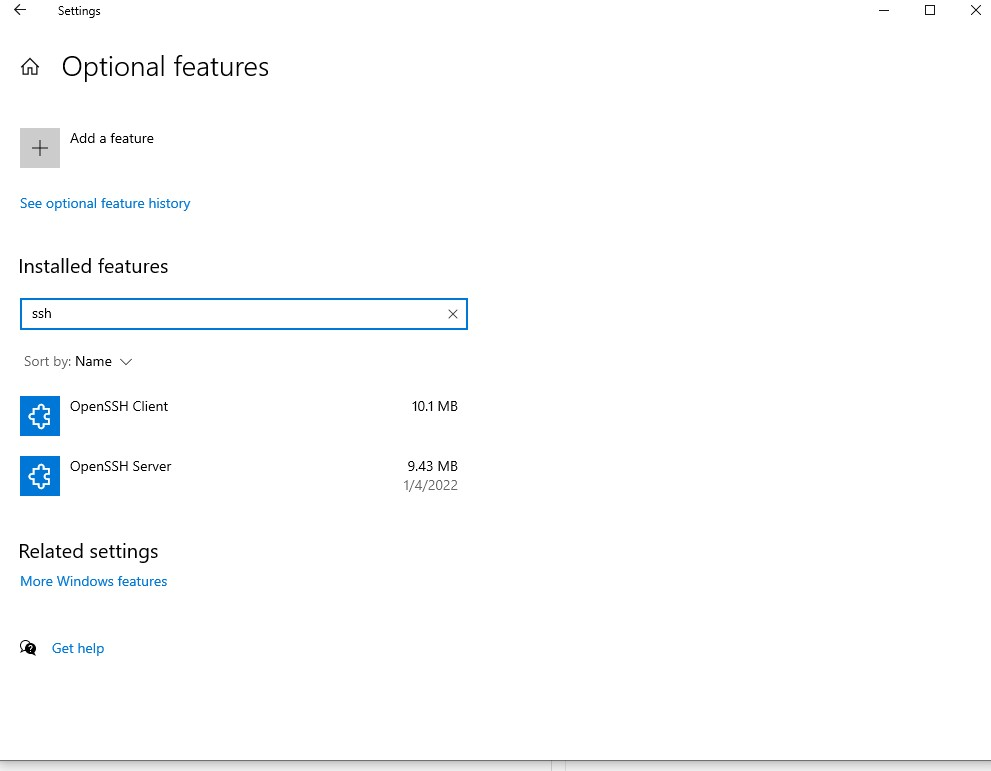

1. go to **settings**, choose **Apps**, then **Apps & Features**, look at **optional features**
2. search if **OpenSSH Client** & **OpenSSH Server** is set up. If not, click **Add a feature** to install these two.
3. after I done, the page shall look like this:

4. Then I set up ssh successfullly.